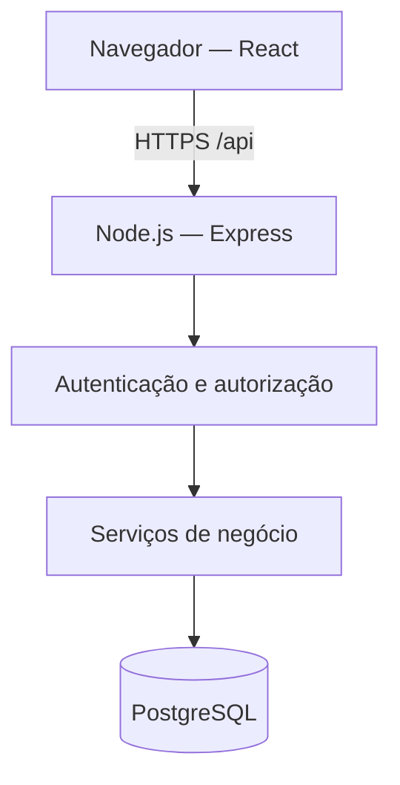

# Arquitetura

## Estado do documento

Arquitetura planejada. A implementação, os testes e o deploy
deverão confirmar ou atualizar as decisões abaixo.

## Visão geral

Uma aplicação React consome uma API Node.js com TypeScript.
A API concentra regras de negócio, autenticação, autorização
e acesso ao PostgreSQL por meio do Prisma.

Frontend e backend ficam no mesmo repositório.

## Tecnologias

- React e TypeScript: interface.
- Vite: desenvolvimento e build do frontend.
- Node.js, TypeScript e Express: API.
- Prisma: acesso ao banco e migrations.
- PostgreSQL: persistência relacional.
- Docker Compose: execução local da aplicação e do banco.

Versões serão fixadas na configuração do projeto e no lockfile.

## Organização planejada

- frontend/src: páginas, componentes e cliente HTTP.
- backend/src/routes: rotas e middlewares de acesso.
- backend/src/services: regras de negócio e transações.
- backend/src/lib: configuração e recursos compartilhados.
- backend/prisma: schema, migrations e seed de demonstração.
- backend/tests: testes.
- docs: documentação.

As rotas validam a entrada e chamam os serviços.
Os serviços concentram regras e operações transacionais.

Não haverá uma camada genérica de repositórios apenas
para encapsular chamadas simples do Prisma.

## Autenticação e autorização

- Login com e-mail e senha.
- Senhas armazenadas com algoritmo próprio para hashing de senhas.
- Sessão de login no servidor, persistida no PostgreSQL.
- Cookie com identificador opaco, HttpOnly, SameSite e Secure
  no ambiente HTTPS.
- Logout invalida a sessão de login.
- Sessões possuem expiração.
- Requisições que alteram dados terão proteção contra CSRF.
- Tentativas de login terão limitação de frequência.
- Nenhum cadastro público.
- Permissões verificadas no backend em cada operação.
- Terapeutas só acessam pacientes com autorização ativa.

A sessão de login é um mecanismo técnico e não deve ser confundida
com TherapySession, que representa um atendimento.

A tabela técnica de sessões de login será definida junto
à implementação da autenticação.

## API e erros

- Prefixo /api.
- Entradas validadas no servidor.
- Listagens paginadas com limite máximo.
- Datas em formato ISO 8601.
- Erros com formato consistente, sem detalhes internos.
- 400 para entrada inválida.
- 401 para ausência de autenticação válida.
- 403 para ação não permitida ao perfil.
- 404 para recurso inexistente ou fora do escopo de acesso.
- 409 para conflitos de estado ou unicidade.
- 500 para falhas inesperadas, com mensagem genérica.
- Documentação OpenAPI refletindo os endpoints implementados.

## Desenvolvimento local

- PostgreSQL executado por Docker Compose.
- Frontend e backend podem rodar separadamente durante
  o desenvolvimento.
- Vite encaminha /api ao backend.
- .env.example documenta configurações sem secrets reais.
- Migrations criam o schema.
- Seed explícito disponibiliza dados fictícios.
- O seed nunca apaga automaticamente dados existentes.

## Deploy simplificado

- Um serviço Node.js serve a API e os arquivos do build React.
- Frontend e API usam a mesma origem.
- PostgreSQL separado, preferencialmente gerenciado.
- HTTPS fornecido pela plataforma de hospedagem.
- Secrets configurados no ambiente.
- Credenciais do banco acessíveis somente ao backend.
- /api/health verifica se o processo responde.
- /api/ready verifica a disponibilidade do banco sem expor detalhes.

O provedor será escolhido e documentado durante o primeiro deploy.

## Publicação de mudanças

1. Executar verificação de tipos e testes.
2. Gerar o build.
3. Revisar migrations e possíveis impactos.
4. Aplicar migrations pendentes como etapa controlada de publicação.
5. Publicar a versão da aplicação.
6. Verificar readiness, login e fluxo principal.

Migrations já aplicadas não serão reescritas.

Rollback da aplicação só é seguro se a versão anterior continuar
compatível com o schema. Mudanças destrutivas exigem planejamento,
backup e estratégia específica; não basta desfazer o deploy.

## CI

O pipeline deverá executar:

- Instalação pelo lockfile.
- Verificação de tipos.
- Testes automatizados.
- Build.

Testes de integração usarão PostgreSQL isolado com migrations
aplicadas, sem conexão com o banco publicado.

## Segurança e operação

- Dados fictícios na demonstração.
- Secrets fora do Git.
- Respostas e logs sem senhas, hashes ou tokens.
- Logs sem nomes de pacientes ou resultados clínicos.
- Logs operacionais com identificador da requisição.
- Banco sem acesso público irrestrito.
- Backups e restauração deverão ser definidos antes de uso real.

## Evolução possível

### Antes de operar com dados reais

- Revisar permissões com a clínica.
- Implementar correções de registros com rastreabilidade.
- Definir auditoria de acessos e alterações.
- Definir retenção de dados e procedimentos operacionais.
- Testar restauração de backups.
- Revisar segurança e requisitos de privacidade aplicáveis.

### Conforme o volume aumentar

- Medir latência, erros, conexões e consultas lentas.
- Ajustar consultas, índices e pool de conexões.
- Escalar a API horizontalmente se houver necessidade.
- Manter sessões de login compartilhadas entre instâncias.
- Usar banco com alta disponibilidade quando houver exigência.
- Adicionar processamento assíncrono para tarefas demoradas,
  como relatórios, apenas quando existirem.

## Deployment

The demonstration runs as a single Node.js service on Render.
Express serves both the API and the compiled React application.
Application data and login sessions are stored in PostgreSQL.

The frontend and API share the same origin. Authentication uses
HTTP-only session cookies, with secure cookies enabled in production.

Database migrations run before the application starts. The demo seed
creates missing demonstration accounts without deleting existing data.

This startup process is a simplification for the single-instance demo.
For a production environment with multiple instances, migrations should
run in a separate deployment step.

The free hosting plan has availability and retention limitations,
including database expiration after 30 days. The demonstration uses
fictional data only.