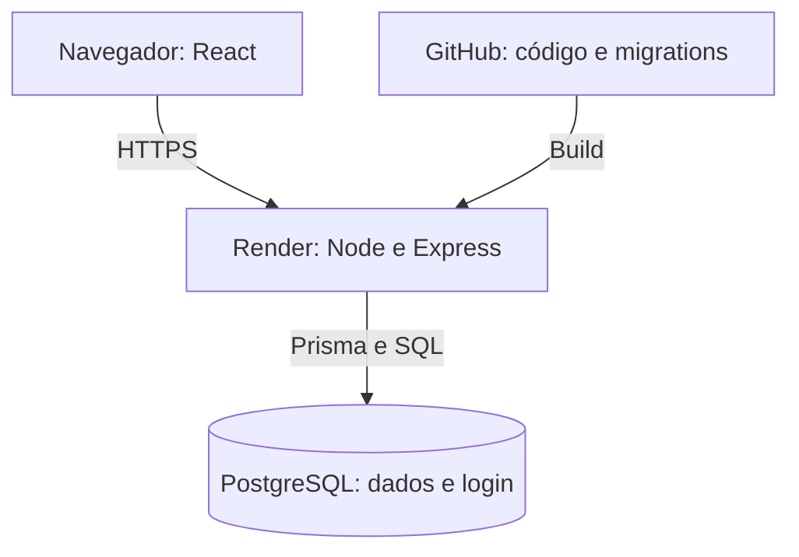

# Da implementação à operação

## Como está publicado

O navegador carrega o React do mesmo serviço Node que responde à API.
Express verifica autenticação e permissões antes de consultar o PostgreSQL.
O banco guarda tanto os dados do atendimento quanto as sessões de login.

No desenvolvimento, Vite serve a interface e encaminha /api para o Express.
Docker Compose sobe apenas o PostgreSQL. Os comandos e variáveis estão no
README para que o avaliador consiga reproduzir o ambiente.

## Como uma mudança chega ao site

A revisão começa localmente: instalação pelo lockfile, migrations no banco
isolado de testes, testes de integração e build. Alterações de schema também
exigem ler o SQL gerado; uma migration válida pode apagar dados se for inadequada.

Depois do commit e push, o deploy do Render instala as dependências e compila
a aplicação. Na inicialização, migrate deploy aplica migrations pendentes e o
seed configura as duas contas iniciais. O seed atualiza seus nomes para admin
e terapeuta_1, mas preserva senhas e vínculos existentes. O serviço é liberado
após iniciar; /api/ready permite conferir a conexão com o banco.

Não há CI configurado no repositório. Automatizar build e testes com um
PostgreSQL isolado seria o próximo passo: evita depender de alguém lembrar
desses comandos. O deploy então deveria depender da aprovação desses checks.

Executar migrations antes do servidor é uma simplificação para uma instância.
Com várias instâncias ou dados reais, essa etapa deve ser separada e controlada.
O seed de avaliação também deve sair da inicialização de um ambiente clínico.

## E se o deploy der errado?

Voltar o código não desfaz a migration. A versão anterior precisa aceitar o
schema que ficou no banco. Por isso, mudanças maiores devem ser feitas em
etapas: adicionar a estrutura nova, adaptar o código e os dados, e só depois
remover o que deixou de ser usado. Migrations já aplicadas não são reescritas.

Antes de uma mudança destrutiva, é necessário ter backup e restauração testada.
Não há backup validado nesta entrega. O plano gratuito do Render também tem
suspensão por inatividade e PostgreSQL com validade de 30 dias; ele serve à
avaliação, não à continuidade de um atendimento clínico.

## Cuidados que já fazem parte do código

As permissões são verificadas no backend, por paciente. Esconder um botão não
é controle de acesso. A revogação bloqueia novas consultas e gravações, enquanto
as sessões anteriores permanecem disponíveis ao administrador.

Senhas são armazenadas com Argon2id. O cookie de login é HttpOnly, SameSite=Lax
e Secure em produção. A sessão é regenerada no login, destruída no logout e
expira. Escritas exigem a origem configurada, e tentativas de login têm limite.
Secrets ficam em variáveis de ambiente. Erros inesperados retornam mensagem
genérica; os logs não precisam conter nomes, senhas ou resultados clínicos.

Validações de entrada, FKs e transações evitam dados incoerentes. Não foram
removidas para encurtar o código, porque sustentam os requisitos de acesso e
preservação do histórico. Os dados usados na avaliação devem ser fictícios.

## O que priorizar antes de dados reais

Primeiro, confirmar a matriz de permissões com a clínica e usar contas
individuais. Definir como corrigir coletas, registrar autor e motivo das
alterações, e auditar acessos sem espalhar conteúdo clínico pelos logs.

Depois, adotar banco com backup, testar recuperação e combinar metas de tempo
de indisponibilidade e perda aceitável de dados. Restringir acesso de rede ao
banco e separar credenciais de migrations e da aplicação. Retenção e processos
de privacidade precisam ser definidos com os responsáveis pelo serviço.

## Se o volume crescer

Medir consultas lentas, latência, erros e conexões antes de mudar a arquitetura.
Expandir paginação e ajustar índices conforme consultas reais. Sessões de login
já são compartilhadas no banco, mas o limitador de login usa memória local e
precisaria de estado compartilhado ao adicionar instâncias.

Separar relatórios demorados em tarefas assíncronas pode fazer sentido quando
eles existirem. O fluxo atual salva pequenas transações e não precisa de filas
ou microsserviços para funcionar.
