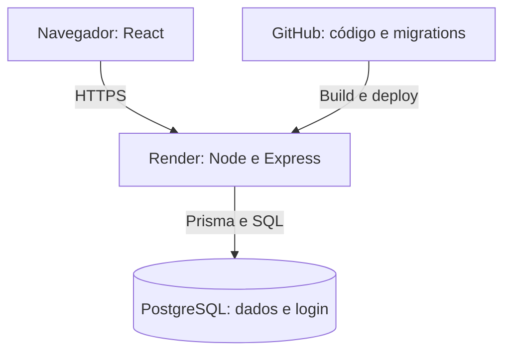

# Arquitetura

## Como está publicado

React e API Express são publicados no mesmo serviço Node no Render,
com PostgreSQL separado. Isso simplifica o deploy e mantém a mesma origem.

Localmente, Vite serve o frontend e encaminha /api para o Express.
Docker Compose executa apenas o PostgreSQL. Os comandos estão no README.

As migrations do Prisma são versionadas no Git e aplicadas antes de
iniciar o servidor. Build e testes são executados localmente antes
da publicação; ainda não há CI configurado.

## Evolução da arquitetura

Automatizaria build e testes em CI, condicionando a publicação ao resultado
dessas verificações e separando a execução das migrations do início da aplicação.

Antes de usar dados reais, adotaria contas individuais, auditoria de acessos
e backups com restauração testada. A correção de coletas precisaria preservar
o resultado anterior, o autor e o motivo da alteração.

Para operação contínua, substituiria o plano gratuito por uma estrutura
com disponibilidade adequada. O ambiente atual pode suspender por
inatividade, e o banco gratuito tem validade limitada.

Se o volume aumentar, começaria medindo consultas lentas e uso de conexões.
Ajustaria índices e paginação antes de separar serviços. Caso fossem
necessárias várias instâncias da API, as sessões já estariam compartilhadas
no PostgreSQL, mas o limitador de login também precisaria de armazenamento
compartilhado.
