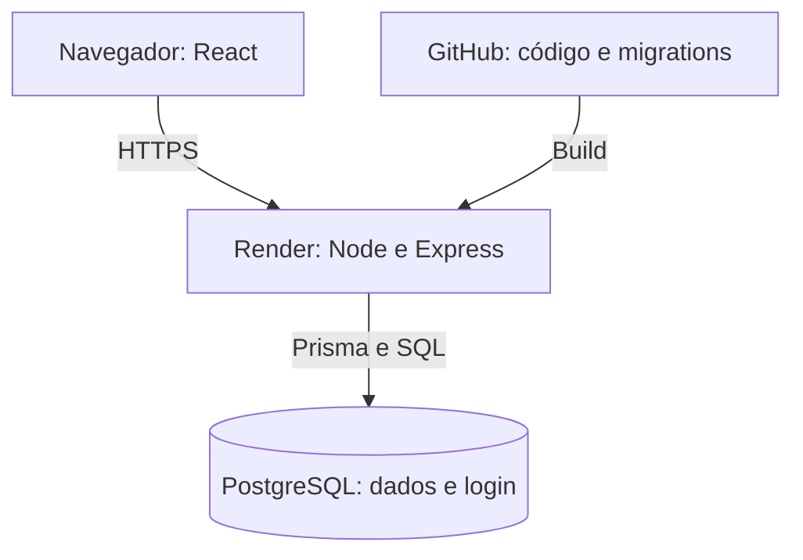

## Como está publicado

- O navegador carrega o React do mesmo serviço Node que responde à API;
- Express verifica autenticação e permissões antes de consultar o PostgreSQL;
- O banco guarda tanto os dados do atendimento quanto as sessões de login

- Vite serve a interface e encaminha /api para o Express.
- Docker Compose sobe apenas o PostgreSQL.
- Comandos e variáveis estão no README para o ambiente ser reproduzido.

## Publicação de mudanças

Antes de publicar, executo os testes com um banco separado e gero o build.
Quando há alteração no modelo, reviso também o SQL da migration.

O código fica no GitHub e o Render publica a aplicação a partir da branch
main. Na inicialização, as migrations pendentes são aplicadas e configuradas
as contas de avaliação. 

Uma reversão do código não desfaz mudanças no banco. Por isso, alterações
de schema devem manter compatibilidade com a versão anterior sempre que
possível. Mudanças que removem dados exigem backup e um plano de recuperação.

## Segurança

- A API verifica o perfil do usuário e sua autorização para cada paciente.
- Revogar o acesso impede novas consultas e registros, mas preserva os
atendimentos anteriores.

As senhas são armazenadas com Argon2id. O login usa uma sessão no servidor
e cookie HttpOnly, com Secure em produção. Há verificação de origem nas
escritas e limite de tentativas de login. As credenciais ficam em variáveis
de ambiente, fora do repositório.

## Evolução da arquitetura

A primeira prioridade seria permitir correções de coletas sem sobrescrever
o histórico, registrando o valor anterior, o autor e o motivo da alteração.

Para operação contínua, substituiria o plano gratuito por uma estrutura
com backup e disponibilidade adequados. O ambiente atual pode suspender
por inatividade, e o banco gratuito tem validade limitada.

Se o volume aumentar, começaria medindo consultas lentas e uso de conexões.
Ajustaria índices e paginação antes de separar serviços. Caso fossem
necessárias várias instâncias da API, as sessões já estariam compartilhadas
no PostgreSQL, mas o limitador de login também precisaria de armazenamento
compartilhado.
