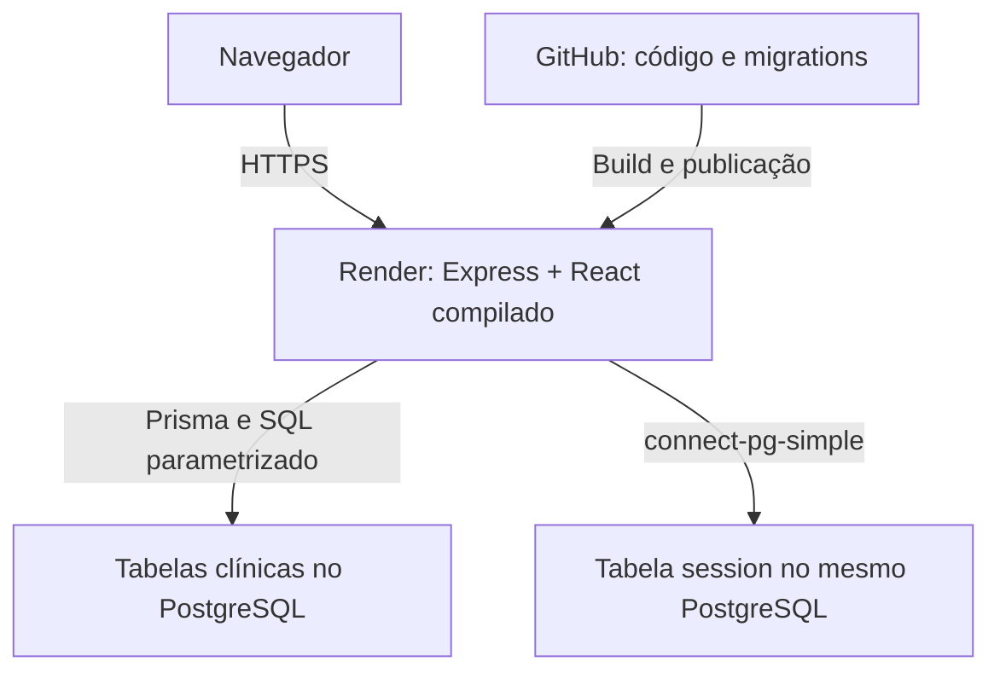

# Arquitetura

## Implementação atual

Um serviço Node.js no Render serve o React compilado e a API Express.
O PostgreSQL guarda dados clínicos fictícios e sessões de login.

O frontend usa páginas React e um cliente HTTP com caminhos relativos
`/api`. A API concentra validações, autenticação, permissões e transações
nos módulos de rotas. Não existe camada de serviços separada.

Durante o desenvolvimento, Vite e Express rodam separadamente e o proxy do
Vite encaminha a API. Docker Compose executa somente o PostgreSQL local.

## Autenticação e acesso

- Login com e-mail e senha; hashes Argon2id.
- Sessão no PostgreSQL, regenerada após login e invalidada no logout.
- Cookie HttpOnly, SameSite=Lax e Secure em produção.
- Origem exata verificada nas operações de escrita, incluindo login.
- Limitação de tentativas de login por IP, em memória no processo.
- ADMIN gerencia pacientes, programas, objetivos e autorizações.
- THERAPIST consulta e registra apenas para pacientes autorizados.
- Credenciais do banco e SESSION_SECRET ficam no ambiente do servidor.

UUID não substitui autorização. A API verifica o perfil e o vínculo com o
paciente. A revogação bloqueia requisições posteriores; ela não remove dados
que já foram recebidos e exibidos no navegador.

## API e persistência

Prisma executa consultas e migrations. As operações críticas usam transações
e bloqueios descritos no [modelo de dados](data-model.md).
Erros são retornados em JSON, com código e mensagem. Falhas inesperadas
produzem resposta genérica, sem stack trace. O log atual dessas falhas é
mínimo, sem conteúdo clínico; não há rastreamento por ID de requisição.

Pacientes e sessões são paginados. Outras listagens têm as limitações
explicitadas no modelo de dados. Não há especificação OpenAPI nesta entrega.

## Publicação e alterações no banco

O README registra os comandos de build, inicialização e variáveis do Render.
O endpoint /api/health verifica o processo; /api/ready consulta o banco.
A configuração de trust proxy é habilitada no ambiente Render para o cookie
seguro funcionar atrás do proxy HTTPS.

O processo de revisão é manual nesta versão; não há workflow de CI no
repositório. Antes de publicar uma alteração:

1. Instalar pelo lockfile com npm ci.
2. Aplicar migrations no banco de testes isolado e executar a suíte.
3. Executar npm run build e revisar o resultado de npm audit.
4. Revisar mudanças no SQL e compatibilidade com dados existentes.
5. Fazer commit e push da revisão aprovada e acompanhar o deploy no Render.
6. Conferir readiness, login e o fluxo clínico no endereço publicado.

No serviço demonstrativo, migrate deploy e o seed executam antes do servidor.
O seed cria contas ausentes e não atualiza senhas nem apaga dados.
Nunca usar migrate reset ou o banco de testes contra o banco publicado.

Migrations aplicadas não são reescritas. Em uma alteração estrutural,
prefira adicionar campos compatíveis, migrar dados e adaptar o código antes
de remover estruturas antigas. Reverter o código não reverte o banco;
rollback só funciona se a versão anterior aceitar o schema atual.

## Limitações conhecidas

- Plano gratuito com suspensão por inatividade e banco com validade limitada.
- Contas de demonstração compartilhadas; nenhum provisionamento de usuários
  pela interface.
- Sem backups configurados e restauração validada nesta entrega.
- Sem auditoria completa de acessos, versionamento de correções ou alertas.
- Limitador de login local ao processo; reinícios limpam os contadores.

Essas limitações não impedem a avaliação com dados fictícios, mas precisam
ser tratadas antes de uma operação clínica real.

## Evolução proposta

### Antes de usar dados reais

Definir com a clínica os perfis e a matriz de acesso, provisionar contas
individuais e revisar a proteção da autenticação. Restringir o acesso de
rede ao banco e separar as permissões de aplicação e migrations.

Adotar banco com backups, testar restauração e definir metas de perda de
dados e tempo de recuperação. Registrar auditoria de acesso e alteração com
acesso restrito, sem copiar conteúdo clínico para logs operacionais.
Implementar correções rastreáveis e definir retenção e procedimentos de
privacidade com os responsáveis. Resolver dependências vulneráveis e revisar
configurações antes dessa mudança de uso.

### Automatizar a publicação

Adicionar CI para instalação pelo lockfile, build e testes com PostgreSQL
isolado. Publicar apenas revisões aprovadas que passaram nas verificações.
Executar migrations em uma etapa de deploy separada, com plano de recuperação.
O seed de demonstração não deve fazer parte da inicialização clínica real.

### Conforme houver necessidade de escala

Medir latência, erros e consultas lentas antes de alterar a topologia.
Ajustar índices e limites de conexões. Se forem necessárias várias instâncias,
as sessões já estão compartilhadas no banco, mas o limitador de login precisa
de armazenamento compartilhado. Expandir paginação das demais listagens.
Relatórios demorados podem ganhar processamento assíncrono quando forem
implementados; não há necessidade de filas no fluxo atual de coleta.
