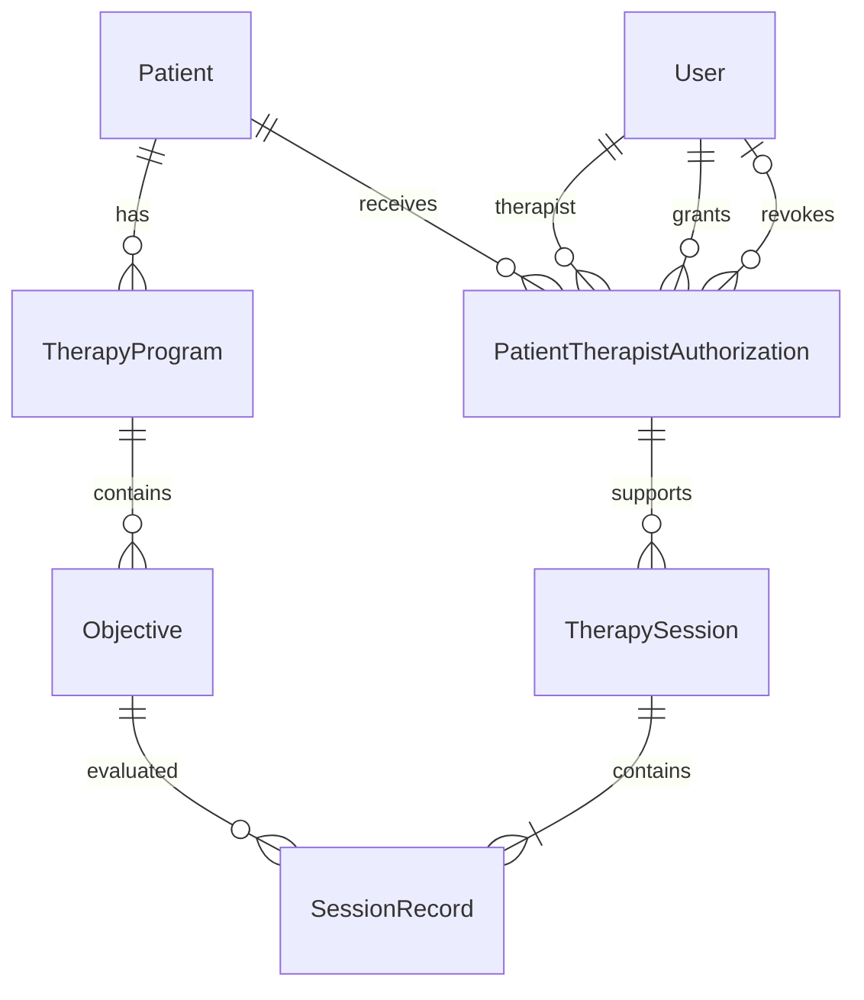

# Como os dados se relacionam

A sessão referencia uma autorização. Por esse caminho, chegamos ao paciente
e ao terapeuta responsável, sem repetir essas duas chaves na sessão. Revogar
preenche a data e o autor da revogação; não remove a linha. Essa é a ligação
que permite preservar o histórico depois que o acesso termina.

## Tabelas

| Tabela | Campos que definem seu papel |
| --- | --- |
| Patient | id, name, guardianName, birthDate |
| User | id, name, email único, passwordHash, role |
| TherapyProgram | id, patientId, name, status |
| Objective | id, programId, description |
| PatientTherapistAuthorization | id, patientId, therapistId, grantedById, grantedAt, revokedById, revokedAt |
| TherapySession | id, authorizationId, occurredAt, createdAt |
| SessionRecord | id, sessionId, objectiveId, achieved |

As chaves são UUID. Datas de nascimento usam DATE; instantes clínicos usam
TIMESTAMPTZ(3). O schema completo, inclusive campos de criação e atualização,
está em `backend/prisma/schema.prisma`. A tabela técnica `session` guarda
login (sid, sess e expire) e não representa atendimento.

Dois pacientes podem ter programas com o mesmo nome, mas são programas
independentes. Compartilhar a mesma linha faria o estado de um paciente
interferir no tratamento de outro. Um catálogo de modelos seria outra entidade.

## O que o banco garante

As FKs impedem referências inexistentes e exclusões de registros usados.
UNIQUE(sessionId, objectiveId) impede duas coletas do mesmo objetivo na sessão.
Um índice único parcial em (patientId, therapistId), com revokedAt nulo,
impede duas autorizações ativas, inclusive em concessões simultâneas.

Há CHECKs para exigir autor e data de revogação juntos e impedir revogação
anterior à concessão. O índice parcial e os CHECKs estão no SQL da migration,
não inteiramente representados no schema Prisma.

Os índices acompanham as consultas: programas por paciente, objetivos por
programa, autorizações por paciente e terapeuta, sessões por autorização e data.
Não foram criados índices para todos os campos.

## O que depende da aplicação

Uma FK não verifica se o objetivo pertence ao mesmo paciente da sessão. Essa
verificação é feita na API, junto com perfil, autorização ativa, datas e estado
do programa. A exigência de pelo menos uma coleta, representada no diagrama,
também é da API. Cada sessão aceita até 100 resultados.

Na exclusão, as FKs continuam sendo a última proteção. Um paciente com programas
ou autorizações não é removido. Excluir um programa remove seus objetivos na
mesma transação, somente se não houver coletas. Excluir um objetivo avulso exige
programa não iniciado. Não há exclusão em cascata de atendimentos.

## Se duas operações acontecerem ao mesmo tempo

Ao salvar uma sessão, a transação bloqueia a autorização com SELECT FOR UPDATE,
valida os objetivos e bloqueia os programas em ordem de ID. Só então cria a
sessão e as coletas. A mudança de estado e a exclusão do programa também
bloqueiam essa linha. Criar ou excluir objetivos usa o mesmo bloqueio.

A revogação atualiza a linha de autorização, portanto espera se uma gravação
já estiver usando o bloqueio. Nesse caso, o atendimento termina primeiro e é
preservado. Se a revogação ganhar primeiro, a gravação é rejeitada. O índice
único parcial resolve uma concorrência diferente: duas concessões ativas.

O custo dessa escolha é que operações sobre as mesmas linhas podem esperar.
As transações são curtas e não fazem chamadas externas. Uma alternativa seria
isolamento serializável, com tratamento de novas tentativas após conflitos.

## Limites do histórico

O histórico consulta os nomes atuais. Editar o nome do paciente altera sua
identificação nas consultas; não existe uma cópia do nome por atendimento.
createdAt e updatedAt não são auditoria de alterações.

Pacientes são paginados em até 100 itens; sessões, em páginas de 20. Autorizações
retornam as 100 mais recentes. Programas, objetivos e terapeutas ainda são
listados sem paginação, uma limitação a rever se o volume crescer.
