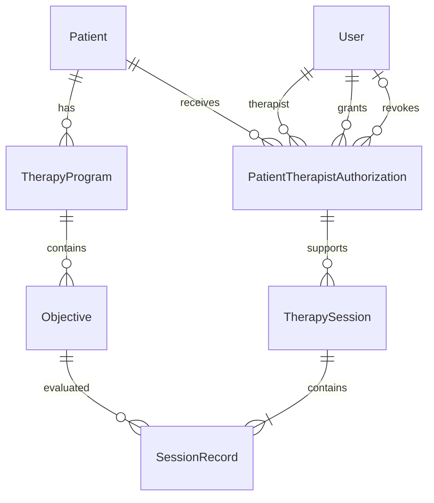

# Modelagem de dados

## Convenções

- Entidades e campos terão nomes em inglês.
- PK identifica a chave primária.
- FK identifica uma chave estrangeira.
- Os campos e relacionamentos serão definidos por etapas.

## Patient

Representa uma pessoa atendida pela clínica.

### Data de nascimento e idade

- Campo: birthDate.
- Tipo no PostgreSQL: DATE.
- Obrigatório: sim.
- Não pode conter uma data futura.
- A idade será calculada a partir da data de nascimento.
- Não haverá um campo age persistido no banco.

### Justificativa

Armazenar somente a idade exigiria atualizações após cada aniversário.
A data de nascimento permite calcular a idade atual e a idade na data
de um atendimento.

### Suposição

O cadastro poderá solicitar a data de nascimento, embora o enunciado
exija apenas a idade. Essa é uma decisão da solução, não um requisito
explícito do desafio.

### Campos de Patient

| Campo | Tipo PostgreSQL | Obrigatório | Descrição |
|---|---|---|---|
| id | UUID | Sim | Chave primária do paciente. |
| name | VARCHAR(150) | Sim | Nome do paciente. |
| guardianName | VARCHAR(150) | Sim | Nome do tutor ou responsável. |
| birthDate | DATE | Sim | Data de nascimento. |
| createdAt | TIMESTAMPTZ | Sim | Data e hora de criação do cadastro. |
| updatedAt | TIMESTAMPTZ | Sim | Data e hora da última atualização do cadastro. |

### Validações

- id será gerado pelo sistema e não poderá ser alterado.
- name e guardianName devem conter de 1 a 150 caracteres após
  a remoção de espaços nas extremidades.
- birthDate deve ser uma data válida e não pode estar no futuro.
- createdAt será preenchido na criação.
- updatedAt será preenchido na criação e atualizado em cada
  alteração do cadastro.
- Os limites de 150 caracteres são decisões da implementação,
  não exigências do enunciado.

### Integridade e índices

- id será a chave primária e terá o índice correspondente.
- name não será único: pacientes diferentes podem ter o mesmo nome.
- Não serão criados índices adicionais sem uma consulta que os justifique.
- Não haverá exclusão de pacientes na primeira versão.

### Responsável

guardianName será um campo do paciente. A primeira versão não exige
cadastro independente de responsáveis, múltiplos responsáveis ou
acesso deles ao sistema.

### Limitação dos timestamps

createdAt e updatedAt indicam quando o cadastro foi criado e alterado.
Eles não registram quem fez a alteração nem os valores anteriores,
portanto não substituem um histórico de auditoria.

## User

Representa um usuário que pode se autenticar no sistema.

### Campos

| Campo | Tipo PostgreSQL | Obrigatório | Descrição |
|---|---|---|---|
| id | UUID | Sim | Chave primária do usuário. |
| name | VARCHAR(150) | Sim | Nome do usuário. |
| email | VARCHAR(254) | Sim | E-mail utilizado no login. |
| passwordHash | TEXT | Sim | Hash da senha; nunca a senha original. |
| role | ENUM: ADMIN, THERAPIST | Sim | Perfil de acesso. |
| createdAt | TIMESTAMPTZ | Sim | Data e hora de criação. |
| updatedAt | TIMESTAMPTZ | Sim | Data e hora da última atualização. |

### Validações e integridade

- id será gerado pelo sistema e não poderá ser alterado.
- name deve conter de 1 a 150 caracteres após remover espaços
  nas extremidades.
- O login exige e-mail não vazio, com no máximo 254 caracteres
  após remover espaços nas extremidades.
- Não há validação completa do formato de e-mail nessa rota.
- Por convenção da aplicação, email será normalizado para letras
  minúsculas e terá espaços removidos das extremidades antes
  de ser salvo ou usado no login.
- email terá uma restrição UNIQUE no banco.
- Cada usuário terá exatamente um perfil nesta versão.
- passwordHash nunca será retornado pela API ou incluído em logs.
- A senha original não será persistida.
- createdAt e updatedAt serão preenchidos pelo sistema.
- Não haverá exclusão de usuários na primeira versão, preservando
  suas referências nos atendimentos.

### Perfis

- ADMIN: gerencia cadastros e autorizações e consulta o histórico
  de todos os pacientes.
- THERAPIST: acessa somente pacientes para os quais possui
  autorização ativa e registra os próprios atendimentos.
- O perfil THERAPIST, sozinho, não concede acesso a nenhum paciente.
- ADMIN não registra atendimentos clínicos nesta versão.

### Suposições e limites

- Não haverá cadastro público de usuários.
- A conta inicial de ADMIN será provisionada na configuração
  do ambiente, sem credenciais fixas no código.
- As contas de demonstração de ADMIN e THERAPIST são criadas pelo seed.
- ADMIN consulta os terapeutas disponíveis para conceder autorizações.
- Não há cadastro de usuários pela interface nesta versão.
- O perfil não poderá ser alterado pela interface nesta versão.
- Recuperação de senha e usuários com múltiplos perfis ficam
  fora do escopo inicial.

### Índices

- Chave primária em id.
- Restrição UNIQUE em email, com seu índice correspondente.

## PatientTherapistAuthorization

Representa um período de autorização de um terapeuta para
acessar e atender um paciente.

### Campos

| Campo | Tipo PostgreSQL | Obrigatório | Descrição |
|---|---|---|---|
| id | UUID | Sim | Chave primária da autorização. |
| patientId | UUID | Sim | FK para Patient.id. |
| therapistId | UUID | Sim | FK para User.id do terapeuta autorizado. |
| grantedById | UUID | Sim | FK para User.id do administrador que autorizou. |
| grantedAt | TIMESTAMPTZ | Sim | Data e hora da concessão. |
| revokedById | UUID | Não | FK para User.id do administrador que revogou. |
| revokedAt | TIMESTAMPTZ | Não | Data e hora da revogação. |

### Estado da autorização

- A autorização está ativa quando revokedAt é NULL.
- A autorização está revogada quando revokedAt está preenchido.
- Não haverá um campo isActive: o estado será determinado
  por revokedAt.
- Uma autorização revogada não será reativada.
- Uma nova concessão criará um novo registro.

### Relacionamentos

- Um paciente pode possuir várias autorizações ao longo do tempo.
- Um terapeuta pode possuir autorizações para vários pacientes.
- Cada autorização pertence a um paciente e a um terapeuta.
- grantedById e revokedById identificam quem gerenciou a permissão.

### Regras verificadas pelo backend

- Somente ADMIN pode conceder ou revogar autorizações.
- O usuário indicado por therapistId deve ter perfil THERAPIST.
- A identidade do administrador vem da autenticação, não de
  um identificador livre enviado pelo cliente.
- As datas de concessão e revogação são definidas pelo sistema.
- Uma nova concessão não pode alterar autorizações anteriores.
- Repetir uma revogação não modifica sua data nem seu autor.
- Revogar não apaga sessões ou coletas existentes.

### Restrições no banco

- Todas as chaves estrangeiras devem referenciar registros existentes.
- As chaves estrangeiras devem impedir exclusões de registros
  referenciados, sem exclusão em cascata.
- revokedAt e revokedById devem estar ambos vazios ou ambos preenchidos.
- Quando preenchido, revokedAt deve ser maior ou igual a grantedAt.
- Deve existir no máximo uma autorização ativa por par
  (patientId, therapistId).

### Índices

- Chave primária em id.
- Índice único parcial em (patientId, therapistId), considerando
  somente registros em que revokedAt IS NULL.

O índice parcial impede duas autorizações ativas para o mesmo
par, inclusive em concessões simultâneas, mas permite manter
vários períodos anteriores já revogados.

### Concorrência

A unicidade da autorização ativa é garantida pelo banco.

A concorrência entre revogar uma autorização e salvar um atendimento
exige uma estratégia transacional adicional, que será definida
na modelagem de TherapySession. O índice parcial, sozinho, não
resolve essa situação.

## TherapyProgram

Representa um programa terapêutico individual de um paciente.
Seus objetivos serão armazenados na entidade Objective.

### Campos

| Campo | Tipo PostgreSQL | Obrigatório | Descrição |
|---|---|---|---|
| id | UUID | Sim | Chave primária do programa. |
| patientId | UUID | Sim | FK para Patient.id. |
| name | VARCHAR(150) | Sim | Nome do programa. |
| status | ENUM: NOT_STARTED, IN_PROGRESS, COMPLETED | Sim | Estado atual do programa. |
| createdAt | TIMESTAMPTZ | Sim | Data e hora de criação. |
| updatedAt | TIMESTAMPTZ | Sim | Data e hora da última atualização. |

### Relacionamentos

- Cada programa pertence a exatamente um paciente.
- Um paciente pode possuir vários programas.
- Um programa pode possuir vários objetivos.
- Um programa recém-criado pode ainda não possuir objetivos.

### Validações e integridade

- id será gerado pelo sistema.
- patientId deve referenciar um paciente existente.
- O paciente associado ao programa não poderá ser alterado.
- name deve conter de 1 a 150 caracteres após remover espaços
  nas extremidades.
- O nome não será único: programas diferentes podem ter o mesmo nome.
- status será NOT_STARTED na criação.
- createdAt e updatedAt serão preenchidos pelo sistema.
- Não haverá exclusão de programas na primeira versão.
- A FK de patientId impedirá excluir um paciente referenciado,
  sem exclusão em cascata.

### Ciclo de vida proposto

As regras abaixo são suposições da solução, pois o enunciado
define os estados, mas não suas transições.

- Somente ADMIN pode criar programas ou alterar seu estado.
- As transições permitidas são:
  - NOT_STARTED → IN_PROGRESS.
  - IN_PROGRESS → COMPLETED.
- Para iniciar um programa, ele deve possuir pelo menos um objetivo.
- Não haverá reabertura de programas concluídos nesta versão.
- Solicitar o estado atual não altera o programa.
- O resultado de uma coleta não altera automaticamente o estado
  do programa.
- Concluir um programa é uma decisão administrativa, não um
  cálculo baseado em resultados positivos.

### Relação com as coletas

- Novas coletas só serão aceitas para objetivos de programas
  que estejam IN_PROGRESS no momento da gravação.
- Concluir um programa não altera ou exclui coletas anteriores.
- O histórico continuará disponível conforme as permissões
  de acesso ao paciente.

### Índices

- Chave primária em id.
- Índice em patientId para consultar os programas de um paciente.

## Objective

Representa um objetivo de um programa terapêutico.

### Campos

| Campo | Tipo PostgreSQL | Obrigatório | Descrição |
|---|---|---|---|
| id | UUID | Sim | Chave primária. |
| programId | UUID | Sim | FK para TherapyProgram.id. |
| description | VARCHAR(500) | Sim | Descrição do objetivo. |
| createdAt | TIMESTAMPTZ | Sim | Data e hora de criação. |
| updatedAt | TIMESTAMPTZ | Sim | Data e hora da última atualização. |

### Regras

- Cada objetivo pertence a exatamente um programa.
- description deve conter entre 1 e 500 caracteres após trim.
- Somente ADMIN gerencia objetivos.
- Objetivos só podem ser criados enquanto o programa estiver NOT_STARTED.
- Não há edição de objetivos nesta versão.
- programId não pode ser alterado.
- Não haverá exclusão de objetivos na primeira versão.
- A FK impede excluir um programa referenciado.

A ausência de edição preserva o significado dos resultados históricos.
Correções e versionamento de objetivos ficam como evolução.

### Índices

- Chave primária em id.
- Índice em programId para listar os objetivos de um programa.

## TherapySession

Representa um atendimento registrado por um terapeuta.

### Campos

| Campo | Tipo PostgreSQL | Obrigatório | Descrição |
|---|---|---|---|
| id | UUID | Sim | Chave primária. |
| authorizationId | UUID | Sim | FK para PatientTherapistAuthorization.id. |
| occurredAt | TIMESTAMPTZ | Sim | Data e hora do atendimento. |
| createdAt | TIMESTAMPTZ | Sim | Data e hora da gravação. |

### Paciente e terapeuta

O paciente e o terapeuta são identificados pela autorização
referenciada por authorizationId.

Não serão repetidos patientId e therapistId na sessão nesta versão.
Isso evita combinações inconsistentes entre sessão e autorização.

A autorização não pode ser excluída nem ter seu paciente,
terapeuta ou data de concessão alterados após a criação.

### Regras

- Somente THERAPIST registra atendimentos.
- A autorização deve pertencer ao usuário autenticado.
- A autorização deve estar ativa no momento da gravação.
- A sessão deve conter pelo menos uma coleta.
- A sessão e todas as coletas são salvas na mesma transação.
- Não haverá edição ou exclusão de sessões nesta versão.
- Revogar a autorização não modifica sessões anteriores.
- A FK impede excluir a autorização referenciada.

### Data do atendimento

- occurredAt será informado pelo terapeuta.
- Não pode estar no futuro nem ser anterior a grantedAt
  da autorização utilizada.
- O backend também exige autorização ativa no momento da gravação.
- createdAt será definido pelo sistema.

Essa escolha permite registrar um atendimento ocorrido anteriormente
durante a autorização atual. Não permite inserir atendimentos após
a revogação com base em uma autorização antiga.

Datas e horas serão transmitidas com fuso explícito e armazenadas
como TIMESTAMPTZ. A interface exibirá os horários em America/Sao_Paulo.

### Índices

- Chave primária em id.
- Índice composto em (authorizationId, occurredAt) para consultar
  atendimentos relacionados a uma autorização por período.

## SessionRecord

Representa o resultado de um objetivo em uma sessão.

### Campos

| Campo | Tipo PostgreSQL | Obrigatório | Descrição |
|---|---|---|---|
| id | UUID | Sim | Chave primária. |
| sessionId | UUID | Sim | FK para TherapySession.id. |
| objectiveId | UUID | Sim | FK para Objective.id. |
| achieved | BOOLEAN | Sim | Indica se o objetivo foi realizado. |

### Regras

- achieved deve ser explicitamente informado como true ou false.
- Não haverá valor padrão para achieved.
- Ausência de coleta significa objetivo não trabalhado.
- O objetivo deve pertencer ao paciente identificado pela
  autorização da sessão.
- O programa do objetivo deve estar IN_PROGRESS no momento
  da gravação.
- Não haverá edição ou exclusão de coletas nesta versão.
- As FKs impedem excluir sessões ou objetivos referenciados.

### Índices e constraints

- Chave primária em id.
- Restrição UNIQUE em (sessionId, objectiveId).
- Essa restrição impede resultados duplicados e atende
  à consulta de coletas por sessão.

## Responsabilidade pelas validações

O banco garante:

- Chaves primárias e estrangeiras.
- Campos obrigatórios.
- Unicidade de e-mail.
- Unicidade de autorização ativa por paciente e terapeuta.
- Unicidade de coleta por sessão e objetivo.
- Coerência dos campos de revogação por CHECK constraints.

O backend garante:

- Perfis e permissões.
- Formato e limites de entrada.
- Datas válidas segundo as regras da aplicação.
- Correspondência entre o paciente da sessão e dos objetivos.
- Estado dos programas.
- Transições permitidas.
- Imutabilidade dos campos e registros definidos nesta documentação.

Uma FK garante existência do registro relacionado, mas não verifica
sozinha todas as regras de negócio entre entidades.

## Transações e concorrência

### Registro de atendimento

Dentro de uma única transação:

1. Bloquear a linha da autorização para atualização.
2. Verificar usuário autenticado, autorização ativa e datas.
3. Identificar os programas dos objetivos recebidos.
4. Bloquear as linhas dos programas em ordem de id.
5. Validar paciente, estado dos programas e objetivos duplicados.
6. Criar a sessão e todas as coletas.
7. Confirmar a transação.

### Revogação

A revogação atualiza a mesma linha de autorização utilizada
pelo registro do atendimento.

O bloqueio serializa as duas operações:

- Se a revogação confirmar primeiro, o registro será rejeitado.
- Se o atendimento obtiver o bloqueio e confirmar primeiro,
  ele será preservado e a revogação ocorrerá em seguida.

### Conclusão de programas e criação de objetivos

- Mudanças de estado bloqueiam a linha do programa.
- A criação de objetivos também bloqueia o programa
  antes de verificar se ele está NOT_STARTED.
- O registro de atendimento bloqueia os programas antes de
  verificar se estão IN_PROGRESS.

Isso impede que uma mudança concorrente invalide a verificação
antes de a transação terminar.

Os bloqueios serão mantidos apenas durante transações curtas,
sem chamadas a serviços externos.

No Prisma, operações que precisem de SELECT FOR UPDATE utilizarão
SQL parametrizado dentro da transação.

## Diagrama de relacionamentos

## Limitações conhecidas

- Alterações no nome do paciente ou do terapeuta aparecem nas
  consultas históricas; não há snapshots desses nomes.
- createdAt e updatedAt não substituem auditoria completa.
- A primeira versão não oferece correção de coletas clínicas.
- As garantias que dependem do backend pressupõem que gravações
  operacionais sejam feitas pela aplicação, sem acesso direto ao banco.

  ## Sessões de login

LoginSession é uma entidade técnica, mapeada para a tabela session.
Não representa um atendimento clínico.

| Campo | Tipo PostgreSQL | Finalidade |
| --- | --- | --- |
| sid | VARCHAR, chave primária | Identificador da sessão de login. |
| sess | JSON | Dados da sessão mantidos pelo servidor. |
| expire | TIMESTAMP(6) | Expiração da sessão. |

Existe um índice em expire para auxiliar a limpeza de sessões expiradas.

## Limites implementados

- Cada atendimento aceita de 1 a 100 coletas.
- Pacientes possuem paginação com limite máximo de 100 itens.
- O histórico de sessões utiliza páginas de 20 itens.
- Autorizações retornam as 100 mais recentes, sem paginação.
- Programas, objetivos e terapeutas não possuem paginação nesta versão.

A API exige pelo menos uma coleta por atendimento. Essa cardinalidade
mínima não é garantida apenas pelas chaves estrangeiras do banco.