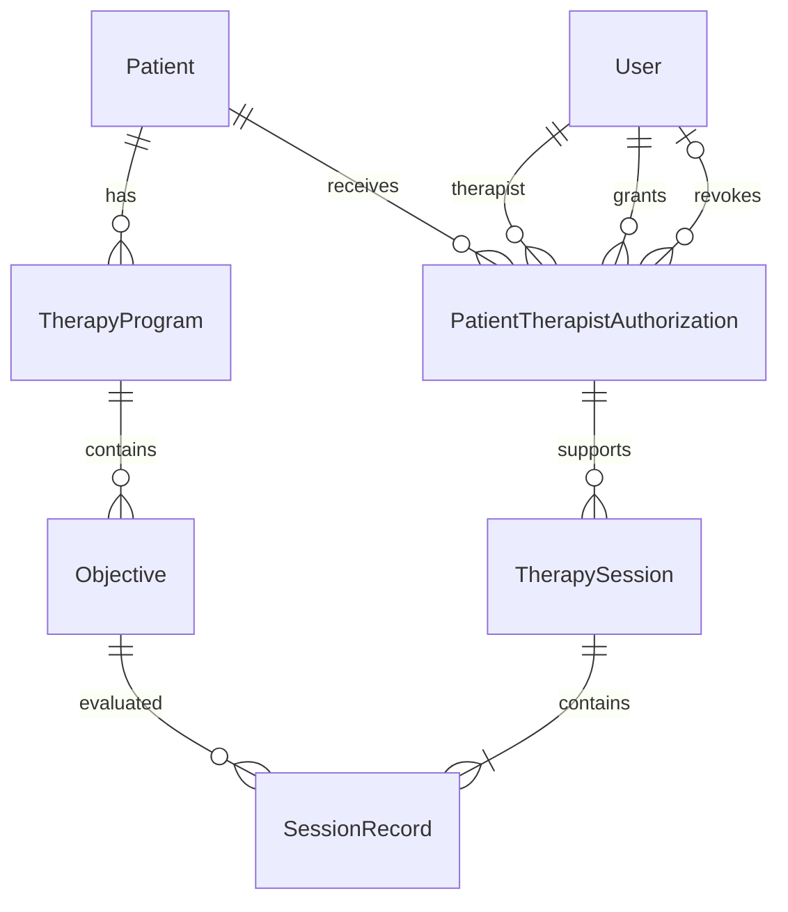

# Modelo de dados

A sessão referencia a autorização utilizada no atendimento. Por ela,
identificamos o paciente e o terapeuta, sem repetir essas chaves na sessão.
Revogar o acesso preenche a data e o autor da revogação, preservando
a autorização e os atendimentos anteriores.

## Tabelas

| Tabela | Campos principais |
| --- | --- |
| Patient | id, name, guardianName, birthDate |
| User | id, name, email, passwordHash, role |
| TherapyProgram | id, patientId, name, status |
| Objective | id, programId, description |
| PatientTherapistAuthorization | id, patientId, therapistId, grantedById, grantedAt, revokedById, revokedAt |
| TherapySession | id, authorizationId, occurredAt, createdAt |
| SessionRecord | id, sessionId, objectiveId, achieved |

As entidades de negócio usam UUID. A idade é calculada a partir de
birthDate para não ficar desatualizada. Cada programa pertence a um
paciente, mesmo que outros pacientes tenham programas com o mesmo nome.
O schema completo está em `backend/prisma/schema.prisma`.
A tabela técnica `session`, usada pelo login, foi omitida do diagrama.

## Integridade e regras

- O banco impede coletas duplicadas por sessão e objetivo. Um índice
  único parcial impede mais de uma autorização ativa para o mesmo
  paciente e terapeuta, mantendo as autorizações revogadas.
- As chaves estrangeiras protegem registros referenciados. Os CHECKs
  exigem autor e data de revogação juntos e impedem uma revogação
  anterior à concessão.
- A API verifica o perfil, a autorização ativa e se os objetivos
  pertencem ao paciente e a programas em andamento.
- Cada sessão exige pelo menos uma coleta, regra garantida pela API.
  false significa trabalhado e não realizado; ausência de coleta
  significa não trabalhado.
- Programas com coletas são preservados. Objetivos avulsos só podem
  ser excluídos antes do início do programa. Pacientes com programas
  ou autorizações não podem ser apagados.

## Concorrência

Sessão e coletas são salvas na mesma transação. A gravação bloqueia
a autorização e os programas envolvidos para coordenar o atendimento
com revogações, mudanças de estado e exclusões
Se a gravação concluir primeiro, o atendimento é preservado e a
revogação ocorre depois. Se a revogação concluir primeiro, a gravação
é rejeitada. Operações sobre as mesmas linhas podem precisar esperar.

## Limitação do histórico

O histórico utiliza os nomes atuais dos cadastros. Não há versões
dos dados anteriores nem auditoria completa de alterações.
