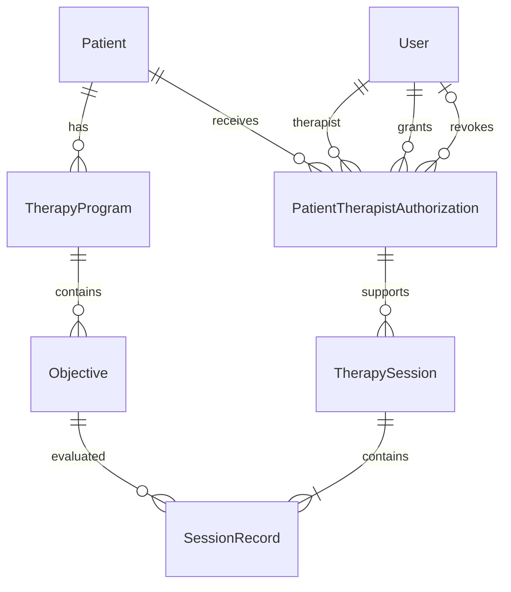

# Como os dados se relacionam

A sessão referencia uma autorização. Por esse caminho, chegamos ao paciente
e ao terapeuta responsável, sem repetir essas duas chaves na sessão. Revogar
preenche a data e o autor da revogação; não remove a linha. Essa é a ligação
que permite preservar o histórico depois que o acesso termina.

## Tabelas

| Tabela | Campos que definem seu papel |
| --- | --- |
| Patient | id, name, guardianName, birthDate |
| User | id, name, email único, passwordHash, role |
| TherapyProgram | id, patientId, name, status |
| Objective | id, programId, description |
| PatientTherapistAuthorization | id, patientId, therapistId, grantedById, grantedAt, revokedById, revokedAt |
| TherapySession | id, authorizationId, occurredAt, createdAt |
| SessionRecord | id, sessionId, objectiveId, achieved |

As chaves são UUID. Datas de nascimento usam DATE; instantes clínicos usam
TIMESTAMPTZ(3). O schema completo, inclusive campos de criação e atualização,
está em `backend/prisma/schema.prisma`. A tabela técnica `session` guarda
login (sid, sess e expire) e não representa atendimento.
Dois pacientes podem ter programas com o mesmo nome, mas são programas
independentes. Compartilhar a mesma linha faria o estado de um paciente
interferir no tratamento de outro. Um catálogo de modelos seria outra entidade.

## Integridade dos dados

Algumas regras ficam no banco para continuarem valendo mesmo quando
duas requisições chegam ao mesmo tempo. A combinação (sessionId, objectiveId)
é única, evitando dois resultados para o mesmo objetivo na mesma sessão.
Também há um índice único para autorizações ativas por paciente e terapeuta.
Autorizações revogadas ficam fora desse índice, permitindo uma nova concessão
sem perder as anteriores.

As chaves estrangeiras impedem referências inexistentes e protegem os
registros que já possuem vínculos. Os CHECKs exigem que autor e data de
revogação sejam preenchidos juntos e que a revogação não anteceda a concessão.
Essas restrições e o índice parcial estão definidos no SQL da migration.
Os demais índices atendem às consultas usadas pela aplicação, como listar
programas de um paciente e buscar atendimentos por autorização e data.

## Regras verificadas pela API

As chaves estrangeiras garantem que paciente e objetivo existam, mas não
que o objetivo pertença ao paciente atendido. Essa conferência fica na API,
junto com a autorização do terapeuta, as datas e o estado dos programas.
A exclusão também respeita esses vínculos. Um programa sem coletas pode ser
removido com seus objetivos. Se já houver resultados, ele é preservado.
Objetivos avulsos só podem ser excluídos antes do início do programa, e
pacientes com programas ou autorizações não podem ser apagados.

## Gravação e revogação simultâneas

Não basta consultar a autorização e depois salvar: ela poderia ser revogada
entre essas duas operações.
Por isso, a gravação usa uma transação e bloqueia a autorização com
SELECT FOR UPDATE. Os programas envolvidos também são bloqueados, sempre
em ordem de ID, para coordenar a gravação com mudanças de estado e exclusões.
Se a gravação obtiver o bloqueio primeiro e concluir, o atendimento é salvo
e a revogação acontece depois. Se a revogação concluir primeiro, a gravação
é rejeitada. Sessão e resultados são salvos juntos; uma falha desfaz a operação.
Essa escolha pode fazer uma requisição esperar pela outra. Para limitar
essa espera, as transações ficam restritas às operações de banco, sem
chamadas a serviços externos.

## Limitação do histórico

O histórico mostra os nomes atuais dos cadastros. Se o nome do paciente
for corrigido, a consulta passa a mostrar o nome corrigido, inclusive nos
atendimentos anteriores. Não há uma cópia dos dados cadastrais por sessão.
Os campos createdAt e updatedAt registram datas, mas não guardam os valores
anteriores nem quem fez cada alteração. Uma auditoria completa fica como
evolução.
